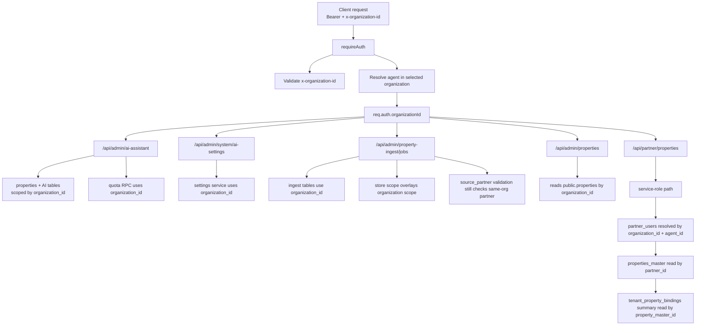

# Org Consistency Audit v1

本文件根據 [tenant-partner-ai-property-flow-v1.md](/Users/chishenhsu/Desktop/Codex/星澄地所HOSHISUMI/docs/architecture/tenant-partner-ai-property-flow-v1.md) 的 RULE 1-4，針對目前 staging runtime 做靜態 audit。

本文件只做 audit，不修改程式。

## 0. Audit Scope

本次 audit 聚焦：

- `/api/admin/ai-*`
- `/api/admin/property-ingest/*`
- `/api/admin/properties`
- `property_ingest_jobs`
- `tenant_property_bindings`
- `partner_authorizations`

## 1. Org Context Flow

## 2. Audit Findings

### 2.1 Most Important Inconsistencies

1. `partner_authorizations` 沒有進入 `property-ingest` 的核心驗證流程。
   - `property_ingest_jobs` 建立時，`source_partner_id` 仍以 `partners.organization_id = auth.organizationId` 驗證。
   - 這與 tenant / partner 必須透過授權關係連接的 architecture 不一致。

2. `/api/admin/properties` 仍然使用 `public.properties` 作為 admin list subject。
   - API 有使用 `organization_id`。
   - 但它沒有轉到 `tenant_property_bindings` 這個 tenant-visible layer。

3. `tenant_property_bindings.organization_id` 雖然存在，但 runtime 使用不足。
   - tenant admin 主要路徑沒有把它當成核心讀模型。
   - 目前主要出現在 partner detail / debug summary。

4. `tenant_property_bindings` 在現有 migration 中沒有完整的 org-scoped RLS/policy model。
   - table 有 `organization_id`。
   - 但目前不是一張完整 tenant-facing、org-scoped app table。

5. `partner_authorizations` 確實有被使用，但只用在 partner discovery / partner detail / partners RLS。
   - 尚未成為 Japan partner source ingest 的唯一授權來源。

### 2.2 RULE 1 Audit

`RULE 1: 所有 API 必須帶 x-organization-id`

目前被 audit 的 admin APIs 沒有發現缺少 `x-organization-id` 的 endpoint。

原因：

- 所有被檢查路由都掛在 `requireAuth`
- `requireAuth` 明確要求 `x-organization-id`

參考：

- [auth.js](/Users/chishenhsu/Desktop/Codex/星澄地所HOSHISUMI/src/middleware/auth.js:22)

### 2.3 RULE 2 Audit

`RULE 2: 所有資料表必須能回答這筆資料屬於哪個 organization`

#### `property_ingest_jobs`

狀態：

- 有 `organization_id`
- 有實際使用
- 有 RLS

結論：

- 符合 RULE 2

參考：

- [20260423120000_phase_j2_property_ingest_v1.sql](/Users/chishenhsu/Desktop/Codex/星澄地所HOSHISUMI/supabase/migrations/20260423120000_phase_j2_property_ingest_v1.sql:3)
- [propertyIngestJobs.js](/Users/chishenhsu/Desktop/Codex/星澄地所HOSHISUMI/src/services/propertyIngestJobs.js:1551)
- [20260423120000_phase_j2_property_ingest_v1.sql](/Users/chishenhsu/Desktop/Codex/星澄地所HOSHISUMI/supabase/migrations/20260423120000_phase_j2_property_ingest_v1.sql:190)

#### `tenant_property_bindings`

狀態：

- 有 `organization_id`
- 有 index / unique
- 但 tenant-facing runtime 使用不足
- 也沒有看到完整 RLS/policy

結論：

- schema 層部分符合
- runtime / access model 層未完全符合

參考：

- [20260424170000_phase_j3_partner_management_v1.sql](/Users/chishenhsu/Desktop/Codex/星澄地所HOSHISUMI/supabase/migrations/20260424170000_phase_j3_partner_management_v1.sql:58)
- [partnerProperties.js](/Users/chishenhsu/Desktop/Codex/星澄地所HOSHISUMI/src/routes/partnerProperties.js:364)

### 2.4 RULE 3 Audit

`RULE 3: 不得出現 UI 有組織 / API 沒組織 / DB 不知道組織`

本次沒有發現「API 完全沒有組織」的情況。  
真正的不一致比較像是：

- API 有組織
- DB 也有組織
- 但 API 使用的是舊 subject，沒有對齊新的 architecture layer

最明顯案例：

- `/api/admin/properties`
  - 使用 `organization_id`
  - 但仍直接讀 `public.properties`
  - 尚未轉成 `tenant_property_bindings` 為核心

參考：

- [adminProperties.js](/Users/chishenhsu/Desktop/Codex/星澄地所HOSHISUMI/src/routes/adminProperties.js:282)

### 2.5 RULE 4 Audit

`RULE 4: AI 一定是 tenant 行為，不是 partner 行為`

目前 `/api/admin/ai-assistant` 整體上是 tenant-scoped。

符合點：

- property query 走 `organization_id`
- analyses / copy / versions / usage events 走 `organization_id`
- quota RPC 也使用 tenant organization

未完成點：

- AI 的 property subject 仍是 `public.properties`
- 尚未切換到 tenant-visible binding subject

結論：

- tenant ownership 大方向符合
- canonical subject 還沒對齊新架構

## 3. Endpoint Audit

### 3.1 `/api/admin/ai-*`

#### `/api/admin/ai-assistant`

目前有使用 `organization_id`：

- 讀 property
- 讀 analysis
- 讀 copy generation
- 寫 AI 資料時寫入 `organization_id`
- quota RPC 使用 `scopedOrganizationId(auth)`

結論：

- 沒有「需要 org 但沒用」的 endpoint
- 問題在於 subject 仍是 `public.properties`

參考：

- [adminAiAssistant.js](/Users/chishenhsu/Desktop/Codex/星澄地所HOSHISUMI/src/routes/adminAiAssistant.js:222)
- [adminAiAssistant.js](/Users/chishenhsu/Desktop/Codex/星澄地所HOSHISUMI/src/routes/adminAiAssistant.js:346)
- [adminAiAssistant.js](/Users/chishenhsu/Desktop/Codex/星澄地所HOSHISUMI/src/routes/adminAiAssistant.js:549)
- [demoScope.js](/Users/chishenhsu/Desktop/Codex/星澄地所HOSHISUMI/src/services/demoScope.js:15)

#### `/api/admin/system/ai-settings`

目前有直接使用 `req.auth.organizationId`。

結論：

- 組織一致性正常

參考：

- [adminSystemAiSettings.js](/Users/chishenhsu/Desktop/Codex/星澄地所HOSHISUMI/src/routes/adminSystemAiSettings.js:21)

### 3.2 `/api/admin/property-ingest/*`

目前有明確使用 `organization_id`：

- create 寫入 `organization_id`
- list `.eq('organization_id', auth.organizationId)`
- detail / run / review / approve 會做 job scope check
- DB migration 也有 org-scoped RLS

結論：

- 不是缺 org context
- 真正問題是 `source_partner_id` 驗證錯誤地走 same-org partner 模型

參考：

- [propertyIngestJobs.js](/Users/chishenhsu/Desktop/Codex/星澄地所HOSHISUMI/src/services/propertyIngestJobs.js:681)
- [propertyIngestJobs.js](/Users/chishenhsu/Desktop/Codex/星澄地所HOSHISUMI/src/services/propertyIngestJobs.js:1450)
- [propertyIngestJobs.js](/Users/chishenhsu/Desktop/Codex/星澄地所HOSHISUMI/src/services/propertyIngestJobs.js:1551)
- [propertyIngestJobs.js](/Users/chishenhsu/Desktop/Codex/星澄地所HOSHISUMI/src/services/propertyIngestJobs.js:2011)

### 3.3 `/api/admin/properties`

目前有使用 `organization_id`：

- list 走 `applyDemoReadScope`
- detail 走 `applyDemoReadScope`
- create 走 `applyDemoWriteDefaults`
- patch 走 `applyDemoReadScope`

結論：

- 沒有發現 endpoint 忽略 org context
- 但 subject 仍是舊有 `public.properties`

參考：

- [adminProperties.js](/Users/chishenhsu/Desktop/Codex/星澄地所HOSHISUMI/src/routes/adminProperties.js:258)
- [adminProperties.js](/Users/chishenhsu/Desktop/Codex/星澄地所HOSHISUMI/src/routes/adminProperties.js:356)
- [adminProperties.js](/Users/chishenhsu/Desktop/Codex/星澄地所HOSHISUMI/src/routes/adminProperties.js:546)

## 4. `partner_authorizations` Usage Audit

### 4.1 Where It Is Used

`partner_authorizations` 目前有被用在：

- `/api/partners`
  - partner list
  - partner detail
- `partners` table select policy

參考：

- [partners.js](/Users/chishenhsu/Desktop/Codex/星澄地所HOSHISUMI/src/routes/partners.js:40)
- [partners.js](/Users/chishenhsu/Desktop/Codex/星澄地所HOSHISUMI/src/routes/partners.js:125)
- [20260326200000_phase_2_2_partner_intake_control.sql](/Users/chishenhsu/Desktop/Codex/星澄地所HOSHISUMI/supabase/migrations/20260326200000_phase_2_2_partner_intake_control.sql:90)

### 4.2 Where It Is Not Used But Should Matter

`partner_authorizations` 目前沒有進入：

- `property_ingest_jobs` create validation
- `partnerProperties` partner membership / cross-org authorization decision

因此目前結論是：

- `partner_authorizations` 是真的有用
- 但還不是 source partner governance 的主 enforcement source

## 5. Summary

本次 audit 的總結是：

- admin AI / ingest / properties API 都有接收並實際使用 org context
- `property_ingest_jobs.organization_id` 是一致的、活躍使用中的
- `tenant_property_bindings.organization_id` 雖存在，但目前尚未成為 tenant-facing 主讀模型
- `partner_authorizations` 確實被使用，但主要用於 partner discovery 與 partners RLS
- 最大不一致點在於：
  - ingest partner validation 沒走 authorization model
  - admin properties 沒切到 tenant binding model
