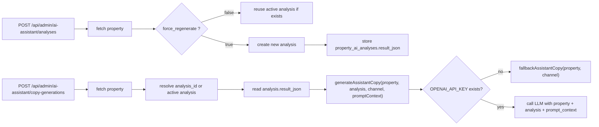

# Staging AI Assistant Copy Analysis Gap Audit v1

staging only

本文件整理 staging AI assistant 在 analysis → copy generation 流程上的 critical gap。  
本輪僅做 audit 與文件整理，不修改 runtime，不 apply migration，不碰 production。

## 1. Purpose

本文件目的：

- 說明 staging `copy-generations` 為何未反映 analysis 結果
- 明確記錄目前 root cause
- 定義 analysis API 與 copy API 的現況資料流
- 提出 staging 修復順序
- 明確限定本輪不碰 production

## 2. Root Cause

目前 staging 的核心 root cause 如下：

1. staging 沒有可用的 `OPENAI_API_KEY`
2. `copy-generations` 因此沒有真的送進 LLM
3. runtime 直接走 `local-fallback`
4. 目前 fallback copy template 沒有使用 `analysis.result_json`

實際 staging 盤點結果顯示：

- `openaiConfigured = false`
- `property_ai_analyses.provider = fallback`
- `property_ai_analyses.model = local-fallback`
- `property_ai_copy_generations.provider = fallback`
- `property_ai_copy_generations.model = local-fallback`

結論：

- 目前 staging 的 copy generation 問題，不是單純 prompt_context 少欄位。
- 真正原因是 runtime 根本沒有走 LLM 路徑，而是直接走 fallback。

## 3. Fallback Gap

目前 fallback 的主要問題：

- `fallbackAssistantCopy` 沒有使用 `analysis.result_json`
- 它只依賴 `property` 的少數欄位
- 因此即使 analysis 已存在，copy 內容仍近似固定模板

目前 fallback 主要使用：

- `property.title_zh`
- `property.title`
- `property.city`
- `property.district`

目前 fallback 沒有實際使用：

- `analysis.highlights`
- `analysis.risk_notes`
- `analysis.target_buyers`
- `analysis.locality_angles`
- `analysis.communication_tips`
- `analysis.suggested_marketing_angles`

結論：

- 現況下 analysis API 與 copy API 雖然有 record 關聯
- 但 fallback copy 在內容生成層面上，幾乎等於沒有吃 analysis

## 4. Japan Property Written As Taiwan

目前 staging 會把日本物件寫成「台灣」，原因不是國別判斷正確，而是 fallback location 字串邏輯過度粗糙。

現況邏輯：

- 先取 `property.city`
- 再取 `property.district`
- 若兩者都為空，fallback 成固定字串 `台灣`

因此當日本物件資料中：

- `city = null`
- `district = null`

就會產生：

- `位置在台灣`
- `台灣精選物件`
- `台灣生活圈精選物件`

這不是資料正規化後的合理結果，而是 fallback copy template 的錯誤預設值。

## 5. Analysis API and Copy API Data Flow

現況資料流如下：

重點：

- analysis API 會寫入 `property_ai_analyses`
- copy API 也會先查 `analysis_id -> analysis record`
- 但在 staging 現況下，最後因為沒有 OpenAI key，copy generation 直接走 fallback
- 一旦進 fallback，analysis 雖然查到了，但內容沒有被真正使用

## 6. Current Behavior Summary

目前 staging 的關鍵現象：

1. `prompt_context_json` 經常為空物件
   - 這表示 request 沒帶額外 context
   - 但這不是主要 root cause

2. `analysis.result_json` 有資料
   - analysis record 並非空白
   - 但 fallback copy 沒有真正使用它

3. copy generation 的 provider/model 顯示 fallback
   - 這證明沒有送到 OpenAI

4. 日本物件會被寫成台灣
   - 因為 fallback location 預設字串錯誤

## 7. Staging Repair Order

建議修復順序如下：

### A. 先讓 backend AI system settings 的 OpenAI key 真正被 runtime 使用

目標：

- staging runtime 必須真正能讀到可用的 OpenAI key
- `generateAssistantCopy()` 與 `analyzePropertyForAssistant()` 必須能走 LLM 路徑

理由：

- 若 runtime 仍停留在 fallback
- 後續再調 prompt 或資料流，結果都不會真正反映到文案品質

### B. `fallbackAssistantCopy` 也必須吃 `analysis`

目標：

- 即使 LLM 不可用
- fallback copy 仍必須依賴 `analysis.result_json`
- 不可只吃 `property`

最低要求：

- 必須使用 analysis 中的 highlights / risks / positioning / location / investment 判斷
- 不可再只靠 title 與 location 預設字串組裝固定文案

理由：

- staging 與 fallback 模式仍需要最低限度可用性
- fallback 不能再成為 analysis 完全失效的旁路

### C. copy generation response 需回 `provider` / `model` / `is_fallback` / `data_sources`

目標：

- API response 必須讓前端與測試人員知道本次文案是怎麼生成的

建議欄位：

- `provider`
- `model`
- `is_fallback`
- `data_sources`

`data_sources` 建議至少可描述：

- `property`
- `analysis`
- `location_enrichment`
- `prompt_context`

理由：

- 目前 UI 很難辨識這次文案到底是 OpenAI、Gemini、還是 local fallback
- 也無法快速知道 analysis 是否真的有被吃進去

### D. Readdy 顯示 AI 生成來源：OpenAI / Gemini / local-fallback

目標：

- Readdy UI 需要清楚顯示本次 AI 文案來源

建議顯示值：

- `OpenAI`
- `Gemini`
- `local-fallback`

理由：

- 讓業務、QA、產品能第一時間辨識生成來源
- 避免把 fallback 輸出誤認為真正的 LLM 結果

## 8. Recommended Outcome

本 audit 建議 staging 先達成以下最低成果：

1. OpenAI key 能被 runtime 正常使用
2. fallback copy 不能忽略 analysis
3. API response 可明確揭露生成來源與資料來源
4. Readdy UI 能辨識 OpenAI / Gemini / local-fallback

## 9. This Round Does Not Do

本輪明確不做：

- production runtime 修改
- production key 配置
- production prompt 調整
- production rollout
- migration apply

## 10. Production Boundary

本文件範圍明確限定：

- staging only
- 不碰 production

任何後續修復都應先在 staging 驗證：

- OpenAI key runtime wiring
- fallback copy 改造
- copy generation response contract
- Readdy 顯示來源資訊
