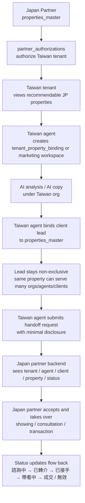

# Taiwan Agent Japan Partner Lead Handoff v1

本文件定義 staging 環境下，「台灣房仲推薦日本物件後，綁定客戶並交接給日本合作方」的資料流、權限邊界、API 合約與 seed 規則。

本文件目標：

- 定義日本 source master 與台灣 tenant workspace 的責任分工
- 定義台灣業務推薦日本物件、生成文案、綁定客戶 lead、交接日本 partner 的完整流程
- 定義最小揭露、授權紀錄、狀態回報的治理規則
- 定義 staging proposal，供 Codex / Readdy / backend 後續一致實作

本文件不代表：

- runtime 已完成
- migration 已 apply
- production 已啟用

## 0. Scope

本文件適用於：

- staging lead handoff architecture proposal
- tenant / partner / lead / handoff / AI workspace 設計
- 後續台灣 tenant 與日本 partner 的 CRM / referral / marketing 協作實作

本文件不處理：

- production rollout
- 實際付款 / 分潤 / 佣金結算
- production 個資法務文本定稿

## 1. Core Principles

### 1.1 Source Master 與 Tenant Workspace 必須分離

- 日本物件來源永遠屬於 `properties_master`
- `properties_master.source_partner_id` 永遠代表日本合作方
- 台灣 tenant 不得修改日本 source master

### 1.2 台灣 tenant 只能建立使用層資料

台灣 tenant 可建立：

- `tenant_property_bindings`
- marketing workspace
- AI analysis / copy
- recommendation
- lead
- handoff request

台灣 tenant 不可建立或改寫：

- 日本 source status
- 日本完整 source 欄位
- 日本 partner 的後續交易狀態主記錄

### 1.3 同一日本物件可多對多使用

同一個 `properties_master.id` 可同時對應：

- 多個台灣 tenant org
- 多位台灣業務
- 多位客戶
- 多筆 lead
- 多筆 handoff

本流程不是獨家綁定模型。

### 1.4 個資揭露必須最小化

日本 partner 在未接手前，不應預設看到完整客戶資料。

客戶資訊揭露必須：

- 由台灣 tenant 主動交接
- 有授權與揭露紀錄
- 可追溯誰在何時揭露了哪些欄位

### 1.5 AI 是台灣 tenant 行為

AI analysis / copy / marketing workspace 屬於台灣 tenant。

日本 partner 可看到交接結果與必要摘要，但不擁有台灣 tenant 的 AI workspace。

## 2. Actors

### 2.1 Taiwan Tenant Organization

台灣房仲組織，擁有：

- 客戶資料
- AI 文案
- 推薦行為
- lead 管理
- handoff 發起權

### 2.2 Taiwan Agent

台灣房仲業務，隸屬於 tenant organization。

業務可以：

- 查看已授權的日本物件
- 為物件生成 AI 文案
- 綁定客戶 lead
- 建立 handoff request

### 2.3 Japan Partner

日本合作房仲，擁有：

- `properties_master`
- 日本原始物件資料
- source 狀態
- 後續帶看 / 交易 / 回報狀態

### 2.4 System Operator

系統方負責：

- tenant 開帳號
- 方案 / 權限 / AI 額度
- feature flags
- `partner_authorizations`

## 3. Lead Handoff Flow

## 4. End-to-End Flow Definition

### 4.1 Recommendable Property Discovery

前提：

- 日本物件存在於 `properties_master`
- 台灣 tenant 與該日本 partner 之間存在 active `partner_authorizations`
- 系統方案允許該 tenant 使用日本物件推薦功能

結果：

- 台灣 tenant 可以在 `/api/admin/properties` 或專用推薦列表中看到可推薦日本物件
- 這些物件是 tenant-visible subject，不等於 tenant 擁有 source master

### 4.2 Marketing Workspace / Binding Creation

當台灣業務對日本物件進行 AI analysis / copy / recommendation 時，系統應在該台灣 org 下建立：

- `tenant_property_binding`
  或
- `tenant_property_marketing_workspace`

其目的為：

- 保存 tenant 端可見性
- 保存 AI 文案與分析
- 保存 lead / handoff 的 tenant 所屬上下文

### 4.3 Lead Binding

台灣業務可將某位客戶 lead 綁定到某個日本物件。

規則：

- lead 綁定不是獨家
- 同一客戶可關注多個日本物件
- 同一日本物件可對應多個客戶
- 同一日本物件可被多個台灣 org 同時推薦

### 4.4 Handoff

台灣業務在確認客戶有實際興趣後，可向日本 partner 發起 handoff。

handoff 必須記錄：

- 哪個台灣 tenant
- 哪位台灣業務
- 哪位客戶
- 關注哪個日本物件
- 目前 handoff 狀態
- 揭露了哪些客戶欄位
- 揭露是否經授權

### 4.5 Japan Partner Takeover

日本 partner 接手後，可更新：

- `諮詢中`
- `已轉介`
- `已接手`
- `帶看中`
- `成交`
- `無效`

但日本 partner 不應回寫台灣 tenant 的：

- AI 文案
- marketing workspace
- tenant visibility

## 5. Table Schema Proposal

以下為 staging proposal。欄位名稱可在正式 implementation 前再收斂，但責任邊界不應改變。

### 5.1 Existing: `properties_master`

用途：

- 日本 partner source master

關鍵欄位：

- `id uuid primary key`
- `source_partner_id uuid not null`
- `source_property_ref text not null`
- `status text not null`
- `title_ja text null`
- `title_zh text null`
- `public_display_address_ja text null`
- `full_private_address_ja text null`
- `hide_exact_address boolean not null default true`
- `address_completeness text not null`

規則：

- 唯一代表日本來源物件
- 不保存台灣 tenant 的 lead / handoff 主資料

### 5.2 Existing / Extended: `tenant_property_bindings`

用途：

- 定義某個台灣 org 對某個日本 source property 的 tenant-visible relationship

建議欄位：

- `id uuid primary key`
- `organization_id uuid not null`
- `property_master_id uuid not null`
- `source_partner_id uuid not null`
- `visibility text not null`
- `tenant_status text not null`
- `marketing_status text not null default 'not_generated'`
- `workspace_status text null`
- `bound_agents_count integer not null default 0`
- `bound_leads_count integer not null default 0`
- `last_handoff_at timestamptz null`

規則：

- 一筆 binding 代表某個 tenant 對某個日本物件的使用層關係
- 可保存 tenant 端 visibility / marketing / lead summary
- 不可取代 `properties_master`

### 5.3 New Proposal: `tenant_property_marketing_workspaces`

用途：

- 保存台灣 tenant 對日本物件的 AI / 推薦 / 行銷工作區

建議欄位：

- `id uuid primary key`
- `organization_id uuid not null`
- `tenant_property_binding_id uuid not null`
- `property_master_id uuid not null`
- `source_partner_id uuid not null`
- `owner_agent_id uuid not null`
- `workspace_type text not null default 'jp_referral'`
- `is_active boolean not null default true`
- `latest_analysis_id uuid null`
- `latest_copy_generation_id uuid null`
- `notes text null`
- `created_at timestamptz not null`
- `updated_at timestamptz not null`

規則：

- 若現階段不想新增 workspace table，可先用 `tenant_property_bindings` 承接
- 但中長期建議把 AI / recommendation 工作區與純 binding 分開

### 5.4 New Proposal: `property_recommendation_leads`

用途：

- 記錄台灣 tenant 把哪位客戶 lead 綁定到哪個日本物件

建議欄位：

- `id uuid primary key`
- `organization_id uuid not null`
- `tenant_property_binding_id uuid not null`
- `property_master_id uuid not null`
- `source_partner_id uuid not null`
- `owner_agent_id uuid not null`
- `client_lead_id uuid not null`
- `recommendation_status text not null default 'active'`
- `interest_level text null`
- `is_exclusive boolean not null default false`
- `created_at timestamptz not null`
- `updated_at timestamptz not null`

規則：

- `is_exclusive` staging 固定為 `false`
- unique key 不應阻止同一物件綁多位客戶

### 5.5 New Proposal: `property_lead_handoffs`

用途：

- 記錄台灣 tenant 對日本 partner 的 lead 交接

建議欄位：

- `id uuid primary key`
- `organization_id uuid not null`
- `source_partner_id uuid not null`
- `property_master_id uuid not null`
- `tenant_property_binding_id uuid not null`
- `recommendation_lead_id uuid not null`
- `handoff_from_agent_id uuid not null`
- `handoff_to_partner_user_id uuid null`
- `status text not null`
- `status_reason text null`
- `handoff_note text null`
- `requested_at timestamptz not null`
- `accepted_at timestamptz null`
- `closed_at timestamptz null`

狀態枚舉：

- `inquiry` 對應 `諮詢中`
- `referred` 對應 `已轉介`
- `accepted` 對應 `已接手`
- `showing` 對應 `帶看中`
- `won` 對應 `成交`
- `invalid` 對應 `無效`

### 5.6 New Proposal: `property_lead_contact_disclosures`

用途：

- 記錄交接時揭露了哪些客戶欄位給日本 partner

建議欄位：

- `id uuid primary key`
- `organization_id uuid not null`
- `property_lead_handoff_id uuid not null`
- `client_lead_id uuid not null`
- `disclosed_by_agent_id uuid not null`
- `disclosure_scope text not null`
- `client_name_shared boolean not null default false`
- `client_phone_shared boolean not null default false`
- `client_email_shared boolean not null default false`
- `client_line_shared boolean not null default false`
- `client_budget_shared boolean not null default false`
- `client_note_shared boolean not null default false`
- `consent_recorded boolean not null default false`
- `consent_record_ref text null`
- `created_at timestamptz not null`

規則：

- 用來滿足最小揭露與授權紀錄
- partner backend 顯示客戶資料時，必須以這張表為準

### 5.7 New Proposal: `property_lead_handoff_status_events`

用途：

- 保存狀態歷程與責任追蹤

建議欄位：

- `id uuid primary key`
- `property_lead_handoff_id uuid not null`
- `organization_id uuid not null`
- `actor_type text not null`
- `actor_agent_id uuid null`
- `actor_partner_user_id uuid null`
- `from_status text null`
- `to_status text not null`
- `event_note text null`
- `created_at timestamptz not null`

規則：

- 每次狀態更新都寫 event log
- 供台灣 tenant、partner 與系統方 audit 使用

## 6. API Proposal

### 6.1 Taiwan Admin APIs

#### `GET /api/admin/japan-properties`

用途：

- 查詢當前 tenant 可推薦的日本物件

回傳重點：

- `property_master_id`
- `source_partner_id`
- `source_partner_name`
- `title`
- `public_display_address`
- `source_status`
- `tenant_binding_id`
- `marketing_status`
- `recommendation_enabled`

規則：

- 只返回 `partner_authorizations` active 的 partner 物件
- 不直接暴露 full private address

#### `POST /api/admin/japan-properties/:propertyMasterId/workspace`

用途：

- 建立 tenant binding 或 marketing workspace

request：

- `owner_agent_id`
- `workspace_type`

response：

- `tenant_binding_id`
- `marketing_workspace_id`
- `marketing_status`

#### `POST /api/admin/japan-property-leads`

用途：

- 將客戶 lead 綁定到日本物件

request：

- `tenant_binding_id`
- `property_master_id`
- `client_lead_id`
- `owner_agent_id`
- `interest_level`
- `note`

response：

- `recommendation_lead_id`
- `is_exclusive`
- `status`

#### `POST /api/admin/japan-property-handoffs`

用途：

- 發起對日本 partner 的交接

request：

- `recommendation_lead_id`
- `handoff_note`
- `disclosure_scope`
- `share_fields`
- `consent_recorded`
- `consent_record_ref`

response：

- `handoff_id`
- `status`
- `disclosed_fields`

#### `GET /api/admin/japan-property-handoffs`

用途：

- 查詢 tenant 自己發起的 handoff 與目前進度

回傳重點：

- `handoff_id`
- `property_master_id`
- `source_partner_name`
- `client_lead_summary`
- `status`
- `last_status_at`

### 6.2 Japan Partner APIs

#### `GET /api/partner/property-handoffs`

用途：

- 日本 partner 查詢所有分派給自己的 handoff

回傳重點：

- `handoff_id`
- `property_master_id`
- `source_property_ref`
- `taiwan_organization_id`
- `taiwan_organization_name`
- `taiwan_agent_id`
- `taiwan_agent_name`
- `client_visible_fields`
- `status`

#### `GET /api/partner/property-handoffs/:id`

用途：

- 查看單筆 handoff 詳情

回傳重點：

- 台灣組織
- 台灣業務
- 客戶摘要
- 客戶已授權揭露欄位
- 物件摘要
- 狀態歷史

#### `POST /api/partner/property-handoffs/:id/accept`

用途：

- 日本 partner 確認接手

結果：

- `status = accepted`
- 寫入 status event

#### `POST /api/partner/property-handoffs/:id/status`

用途：

- 更新 handoff / transaction 狀態

request：

- `status`
- `note`

允許狀態：

- `inquiry`
- `referred`
- `accepted`
- `showing`
- `won`
- `invalid`

### 6.3 System Admin APIs

系統方後續需有能力管理：

- tenant 開帳號
- 方案
- 權限
- AI 額度
- 日本物件推薦功能開關
- `partner_authorizations`

建議至少有：

- `GET /api/system/tenants`
- `POST /api/system/tenants`
- `POST /api/system/tenant-features`
- `POST /api/system/partner-authorizations`

## 7. Permission Model

### 7.1 Taiwan Tenant

可：

- 查看已授權的日本物件
- 建立 tenant binding / marketing workspace
- 建立 AI 文案與推薦
- 綁定客戶 lead
- 發起 handoff

不可：

- 修改 `properties_master`
- 修改日本 source status
- 修改日本 partner 的接手後狀態主記錄

### 7.2 Taiwan Agent

可：

- 讀取自己 org 下可推薦的日本物件
- 建立 recommendation / lead / handoff
- 查看自己 org 下的 handoff 狀態

不可：

- 跨 org 查看別人的 lead
- 對未授權 partner 建立 handoff

### 7.3 Japan Partner

可：

- 查看屬於自己 source property 的 handoff
- 查看已授權揭露的客戶欄位
- 接手後續帶看 / 交易 / 回報狀態

不可：

- 讀取未揭露的客戶欄位
- 反向修改台灣 tenant 的 marketing workspace
- 修改台灣 tenant 的 AI 文案

### 7.4 System Operator

可：

- 管理 tenant / partner / authorization / feature flag / AI quota
- 查 audit log 與 disclosure log

## 8. Client Disclosure Model

### 8.1 Default Rule

在 handoff 前，日本 partner 預設只能看到：

- 物件摘要
- 台灣組織
- 台灣業務
- handoff 狀態

### 8.2 Minimum Disclosure

只有在台灣業務發起 handoff 並記錄 disclosure 後，日本 partner 才能看到被勾選揭露的欄位。

建議揭露等級：

- `anonymous_interest`
  - 僅顯示匿名客戶關注
- `basic_contact`
  - 姓名 + 單一聯絡方式
- `full_referral`
  - 姓名 + 聯絡方式 + 預算 + 備註

### 8.3 Audit Requirement

每次揭露都必須記錄：

- 誰揭露
- 何時揭露
- 揭露哪些欄位
- 客戶是否授權
- 授權參考資料

## 9. Staging Seed Example

### 9.1 Organizations

- 台灣 tenant：
  - `33333333-3333-4333-8333-333333333333`
  - `星澄地所 台北總店（Staging）`

- 日本 partners：
  - `world_eye`
  - `nippon_prime_realty`

### 9.2 Partner Authorizations

staging 必須至少存在：

- `33333333-3333-4333-8333-333333333333` ↔ `world_eye` active
- `33333333-3333-4333-8333-333333333333` ↔ `nippon_prime_realty` active

### 9.3 Sample Property

建議 staging 至少有一筆：

- `properties_master.id = pm_jp_demo_001`
- `source_partner_id = world_eye`
- `source_property_ref = WE-OSAKA-001`
- `title_ja = 大阪市西區収益ワンルーム`

### 9.4 Sample Binding / Workspace

- `tenant_property_bindings.id = tpb_demo_001`
- `organization_id = 33333333-3333-4333-8333-333333333333`
- `property_master_id = pm_jp_demo_001`
- `marketing_status = generated`

- `tenant_property_marketing_workspaces.id = tpw_demo_001`
- `owner_agent_id = owner_agent_demo_tw_001`
- `latest_analysis_id = analysis_demo_001`
- `latest_copy_generation_id = copy_demo_001`

### 9.5 Sample Lead / Handoff

- `property_recommendation_leads.id = prl_demo_001`
- `client_lead_id = client_demo_001`
- `property_master_id = pm_jp_demo_001`

- `property_lead_handoffs.id = plh_demo_001`
- `status = referred`
- `client_name_shared = true`
- `client_phone_shared = true`
- `consent_recorded = true`

## 10. Implementation Notes

### 10.1 Short-Term

staging 可先以 `tenant_property_bindings` 承接 tenant-visible property subject，再逐步把：

- recommendation
- AI workspace
- lead
- handoff

分離成專用資料表。

### 10.2 Long-Term

中長期建議把：

- 物件來源
- 台灣 tenant 使用層
- AI 行銷層
- lead / handoff CRM 層

拆成明確分層，避免 `/api/admin/properties` 同時背負所有責任。

## 11. Non-Goals

本文件目前不處理：

- 佣金拆帳
- partner settlement
- eKYC
- production legal text
- cross-border payment workflow

## 12. Staging Only

本文件為 staging proposal。

明確限制：

- 不改 production schema
- 不改 production runtime
- 不在 production 啟用日本 lead handoff 功能
- 不在 production 開啟 client disclosure 給 partner

任何 runtime / migration / rollout 均應先在 staging 驗證，再另開 production proposal。
