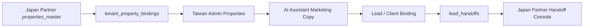

# Tenant Property Binding + Japan Partner Handoff Schema v2

Status: proposal only

## 1. Core Principles

This schema separates the cross-border property flow into three layers:

- `properties_master`
  - Canonical source-of-truth for Japan partner properties.
  - Owned by the Japan partner or partner ingest pipeline.
  - Must not store Taiwan tenant AI output or tenant-specific marketing state.

- `tenant_property_bindings`
  - Tenant-scoped visibility, marketing, AI, and archive state for a Japan source property.
  - One Taiwan tenant organization can bind the same `properties_master` row independently from other tenants.
  - This is the canonical tenant operating layer for Japan inventory.

- `lead_handoffs`
  - Tenant-scoped record of passing a buyer or lead intent from a Taiwan tenant to a Japan partner.
  - This is the canonical cross-border CRM handoff layer.

Canonical rule:

- `public.properties` must not remain the only source of truth for Japan partner inventory.
- `public.properties` is transitional read model only.
- The long-term ownership path is:
  - `properties_master` -> `tenant_property_bindings` -> `lead_handoffs`

## 2. `tenant_property_bindings` v2

Purpose:

- Represent tenant access to a Japan source property.
- Preserve tenant-specific operating state without mutating Japan source-of-truth rows.
- Support transitional compatibility through `linked_property_id`.

Proposed schema:

```sql
create table public.tenant_property_bindings (
  id uuid primary key default gen_random_uuid(),
  organization_id uuid not null references public.organizations(id) on delete cascade,
  property_master_id uuid not null references public.properties_master(id) on delete cascade,
  linked_property_id uuid null references public.properties(id) on delete set null,
  source_partner_id uuid not null references public.partners(id) on delete restrict,
  visibility text not null check (visibility in ('active', 'hidden', 'archived')),
  tenant_status text not null check (tenant_status in ('draft', 'marketing', 'paused', 'closed')),
  marketing_status text not null check (marketing_status in ('not_generated', 'generated', 'updated', 'stale')),
  is_visible_to_agents boolean not null default true,
  is_marketing_enabled boolean not null default true,
  last_marketing_generated_at timestamptz null,
  last_master_synced_at timestamptz null,
  archived_at timestamptz null,
  created_at timestamptz not null default now(),
  updated_at timestamptz not null default now(),
  unique (organization_id, property_master_id)
);
```

Field semantics:

- `organization_id`: Taiwan tenant org that can see and operate this Japan property.
- `property_master_id`: Canonical Japan source property.
- `linked_property_id`: Transitional `public.properties` projection used until read model migration is complete.
- `source_partner_id`: Japan partner owner of the source property.
- `visibility`: Whether the tenant keeps the property active in its operational scope.
- `tenant_status`: Tenant business status, independent from partner source truth.
- `marketing_status`: State of tenant-side AI marketing output freshness.
- `is_visible_to_agents`: Whether tenant agents can browse and use the property.
- `is_marketing_enabled`: Whether AI/copy generation is allowed for this binding.
- `last_marketing_generated_at`: Last successful AI marketing output timestamp.
- `last_master_synced_at`: Last sync from `properties_master`.
- `archived_at`: Archive timestamp when the tenant intentionally retires the binding.

## 3. `lead_handoffs` v2

Purpose:

- Track the operational handoff from Taiwan tenant to Japan partner.
- Preserve disclosure rules, buyer snapshot, and partner-side response status.
- Support partner-facing handoff console without exposing full tenant CRM.

Proposed schema:

```sql
create table public.lead_handoffs (
  id uuid primary key default gen_random_uuid(),
  tenant_organization_id uuid not null references public.organizations(id) on delete cascade,
  source_partner_id uuid not null references public.partners(id) on delete restrict,
  property_master_id uuid not null references public.properties_master(id) on delete restrict,
  tenant_property_binding_id uuid not null references public.tenant_property_bindings(id) on delete restrict,
  linked_property_id uuid null references public.properties(id) on delete set null,
  client_id uuid not null references public.clients(id) on delete restrict,
  lead_id uuid not null references public.leads(id) on delete restrict,
  assigned_agent_id uuid null references public.agents(id) on delete set null,
  handoff_status text not null check (
    handoff_status in (
      'draft',
      'submitted',
      'accepted',
      'contacted',
      'viewing_scheduled',
      'negotiating',
      'closed_won',
      'closed_lost',
      'cancelled'
    )
  ),
  buyer_display_name text null,
  buyer_contact_snapshot jsonb not null default '{}'::jsonb,
  disclosure_scope text not null check (disclosure_scope in ('minimal', 'contact_allowed', 'full_context')),
  handoff_note text null,
  partner_response_note text null,
  submitted_at timestamptz null,
  accepted_at timestamptz null,
  contacted_at timestamptz null,
  closed_at timestamptz null,
  created_at timestamptz not null default now(),
  updated_at timestamptz not null default now()
);
```

Field semantics:

- `tenant_organization_id`: Taiwan tenant that submits the handoff.
- `source_partner_id`: Japan partner responsible for follow-up.
- `property_master_id`: Canonical Japan source property.
- `tenant_property_binding_id`: Tenant binding that originated the marketing and buyer flow.
- `linked_property_id`: Transitional `public.properties` projection when still needed by legacy screens.
- `client_id`: Tenant-side CRM customer row.
- `lead_id`: Tenant-side lead or inquiry row.
- `assigned_agent_id`: Taiwan tenant agent responsible for the handoff.
- `handoff_status`: Shared lifecycle between tenant and partner.
- `buyer_display_name`: Display-safe name visible to partner according to disclosure rules.
- `buyer_contact_snapshot`: Point-in-time permitted contact payload.
- `disclosure_scope`: What the Japan partner is allowed to see.
- `handoff_note`: Taiwan-side context for partner intake.
- `partner_response_note`: Japan-side response or follow-up context.

## 4. Permission Model

### Taiwan tenant

- Can read `tenant_property_bindings` where `organization_id = current tenant org`.
- Can create `lead_handoffs` for its own tenant bindings.
- Can read handoff status for handoffs submitted by its own tenant org.
- Cannot read other tenants' bindings or handoffs.
- Cannot mutate `properties_master` directly.

### Japan partner

- Can read `lead_handoffs` where `source_partner_id` belongs to the current partner scope.
- Cannot read the Taiwan tenant's full CRM tables.
- Can only view customer information permitted by `disclosure_scope`.
- Can update partner-facing handoff workflow state such as `accepted`, `contacted`, `viewing_scheduled`, `negotiating`, `closed_won`, or `closed_lost`.

### System admin

- In staging, may inspect bindings and handoffs for debugging.
- In production, any cross-org inspection or mutation must be covered by audit logging.

## 5. Flow Diagram



## 6. API Proposal

### Tenant-facing

- `GET /api/admin/properties`
  - Return tenant-visible properties.
  - During transition, may include both native Taiwan `public.properties` and Japan binding-backed projections.

- `POST /api/admin/ai-assistant/analyses`
  - Generate tenant-scoped AI analysis from a tenant-visible property subject.
  - Long-term canonical subject should support binding-backed Japan inventory.

- `POST /api/admin/ai-assistant/copy-generations`
  - Generate tenant-scoped marketing copy for a tenant-visible property subject.

- `POST /api/admin/handoffs`
  - Create `lead_handoffs` from tenant binding, client, and lead context.

- `GET /api/admin/handoffs`
  - List handoffs submitted by the current tenant org.

### Partner-facing

- `GET /api/partner/handoffs`
  - List handoffs where `source_partner_id` belongs to current partner membership.
  - Response must redact customer data according to `disclosure_scope`.

- `PATCH /api/partner/handoffs/:id/status`
  - Update partner-side workflow status and response note.

## 7. Staging Seed Example

Canonical staging identities:

- Taiwan tenant org:
  - `33333333-3333-4333-8333-333333333333`
- World Eye partner org:
  - `77777777-7777-4777-8777-777777777777`
- World Eye partner_id:
  - `90000000-0000-4000-8000-000000000001`

Example end-to-end test chain:

- `property_master`
  - `81111111-1111-4111-8111-111111111111`
- `tenant_property_binding`
  - `82222222-2222-4222-8222-222222222221`
- `linked_property`
  - `83333333-3333-4333-8333-333333333221`
- `AI analysis`
  - `8ead3a34-baa1-4a3f-96e9-95b54777d17b`
- `AI copy`
  - `5d9d1a05-5eff-4f4c-bc10-0f6657fbf501`
- `client`
  - `cccccccc-cccc-4ccc-8ccc-cccccccccc02`
- `lead`
  - `dddddddd-dddd-4ddd-8ddd-dddddddddd02`
- `handoff`
  - `eeeeeeee-eeee-4eee-8eee-eeeeeeeeee02`

Target trace:

`property_master`
-> `tenant_property_binding`
-> `linked_property`
-> `AI analysis`
-> `AI copy`
-> `client`
-> `lead`
-> `handoff`

## 8. Explicit Limits

This document is schema and architecture proposal only.

- Do not apply migration.
- Do not modify production.
- Do not remove `public.properties` until read model migration is complete.
