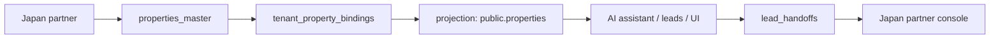

# Tenant Property Binding + Handoff v2 Execution Gate

Status: execution gate only

Related documents:

- [tenant-property-binding-handoff-schema-v2.md](/Users/chishenhsu/Desktop/Codex/星澄地所HOSHISUMI/docs/architecture/tenant-property-binding-handoff-schema-v2.md)
- [tenant-property-binding-handoff-v2-implementation-plan.md](/Users/chishenhsu/Desktop/Codex/星澄地所HOSHISUMI/docs/architecture/tenant-property-binding-handoff-v2-implementation-plan.md)

## 1. Purpose

This document defines the single execution gate for Tenant Property Binding + Handoff v2.

Its purpose is to prevent parallel teams from making incompatible assumptions about:

- current staging reality
- rollout phase boundaries
- forbidden changes
- the only allowed data flow
- Codex and Readdy ownership boundaries

This document is the control document for sequencing work.  
If any implementation idea conflicts with this gate, this gate wins.

## 2. Ground Truth

Current staging reality:

- `properties_master`: already exists as Japan source inventory
- `tenant_property_bindings`: already exists with partial v1 fields
- `public.properties`: still acts as read model and is still used by AI, leads, and UI paths
- AI assistant: already writes in tenant organization scope
- partner API: can already read `properties_master`

Additional operating reality:

- `linked_property_id` is currently the transition bridge between binding-layer Japan inventory and legacy tenant property consumers
- `lead.property_id` still points to `public.properties`
- current admin and AI flows are not yet fully binding-native
- current partner handoff behavior is not yet fully canonical `lead_handoffs` runtime

Interpretation rule:

- do not design against an imagined future system
- do not assume `public.properties` has already been retired
- do not assume all consumers are already binding-aware

## 3. Phase Lock

No work may skip phases.  
No implementation may silently combine Phase 1, Phase 2, and Phase 3 into one rollout.

### Phase 1: current execution window

Allowed:

- do not break schema
- additive schema only if required
- no production change
- read model alignment only
- seed and backfill only within backward-compatible shape
- non-breaking API alignment only

Meaning:

- keep current consumers working
- stabilize `properties_master -> tenant_property_bindings -> public.properties` projection
- preserve existing AI, leads, and admin flows

### Phase 2: formal handoff activation

Allowed after Phase 1 is stable:

- canonical `lead_handoffs` rollout
- partner console starts consuming canonical handoff flow
- partner-facing status workflow begins using canonical handoff state

Meaning:

- handoff becomes a real product path, not just mock or debug trace

### Phase 3: gradual `public.properties` retirement

Allowed only after Phase 2 is accepted:

- move legacy consumers away from `public.properties`
- progressively reduce dependence on transitional projection rows
- prepare full read-model migration completion

Meaning:

- `public.properties` exits only after every dependent path has been replaced or bridged

## 4. Forbidden Changes

DO NOT:

- rewrite `/api/admin/properties` to use `properties_master` directly
- remove `linked_property_id`
- change `lead.property_id` target
- migrate production schema
- change AI contract

All changes must remain backward compatible.

Expanded interpretation:

- do not bypass `tenant_property_bindings` and point tenant UI directly at source-of-truth partner data
- do not delete or invalidate `public.properties` rows still required by AI, lead, or UI consumers
- do not force Readdy to adapt to a breaking contract change during Phase 1
- do not switch partner console to a new canonical model before tenant-side read model alignment is stable
- do not change runtime semantics first and promise compatibility later

## 5. Single Allowed Flow

The only allowed flow in this execution window is:

Japan partner
-> `properties_master`
-> `tenant_property_bindings`
-> projection into `public.properties`
-> AI assistant / leads / UI
-> `lead_handoffs`
-> Japan partner console

Control rule:

- any proposed flow that skips the `public.properties` projection during Phase 1 is not allowed
- any proposed flow that attaches tenant-facing AI or lead runtime directly to `properties_master` is not allowed

## 6. Ownership Split

### Codex may do

- schema changes that are additive only
- seed and backfill
- API changes that are non-breaking

### Readdy may do

- UI display
- selector and filter behavior
- quota UI
- copy rendering

### Overlap is forbidden

- Readdy must not change API contract
- Codex must not change UI

Interpretation examples:

- if a new UI badge or selector needs data, Codex may expose additive fields without breaking old consumers
- if a UI layout or filtering rule changes, Readdy must consume existing or additive contract fields only
- if a contract change is breaking, it is blocked in this phase

## 7. Execution Rules

Before any implementation task starts, it must answer:

1. which phase is this work in
2. does it preserve `public.properties` compatibility
3. does it preserve `linked_property_id`
4. does it avoid changing `lead.property_id`
5. does it avoid breaking the AI contract
6. is the owner Codex or Readdy, but not both

If any answer fails, the task must stop and be re-scoped.

## 8. Acceptance Gate for Phase 1

Phase 1 is complete only when all of the following are true:

1. Japan source rows are stable in `properties_master`
2. tenant rows are stable in `tenant_property_bindings`
3. every required Japan tenant-visible property has a valid `linked_property_id`
4. `/api/admin/properties` still works without breaking existing consumers
5. AI assistant still works in tenant org scope
6. leads still work with existing `property_id` semantics
7. no production schema or production runtime change was required

## 9. Explicit Limits

This document is execution control only.

- Do not treat this file as migration SQL.
- Do not use this file to justify a breaking API rewrite.
- Do not use this file to skip phase order.
- Do not remove `public.properties` until read model migration is complete.
