# HOSHISUMI v1 Core Sales Engine Blueprint

Taiwan Agent x Japan Partner Lead Engine

本文件定義 HOSHISUMI v1 的核心銷售引擎藍圖。

本文件目的是讓台灣業務可以從日本 partner 來源物件出發，完成：

- 選物件
- 生成文案
- 綁客戶
- 交接 lead
- 追蹤成交責任

本文件是 v1 architecture blueprint，不代表：

- runtime 已全部完成
- schema / migration 已 rollout
- production 已啟用

## 1. Goal

本系統 v1 目標不是泛用房仲管理系統，而是：

- 讓台灣業務能拿物件
- 讓台灣業務能生成文案
- 讓台灣業務能綁客戶
- 讓台灣業務能把 lead 交給日本方成交

核心價值：

- AI 賦能業務，不取代業務
- 支援台灣到日本的跨境銷售
- 支援多客戶、非獨家綁定
- 可追蹤來源、推薦行為、成交責任

## 2. Roles

### 2.1 HOSHISUMI System Operator

系統方負責：

- 管理 SaaS
- 控制 AI quota
- 控制功能模組
- 管理 tenant / partner 授權

### 2.2 Taiwan Tenant

台灣房仲負責：

- 使用 AI 文案
- 綁定客戶
- 推薦日本物件
- 發起 lead handoff

台灣 tenant 不負責：

- 最終日本成交
- 日本 source master 編修

### 2.3 Japan Partner

日本合作方負責：

- 提供物件 source of truth
- 接手 lead
- 帶看 / 聯繫 / 簽約
- 回報成交進度

## 3. Core Data Layers

資料層必須分離，不可混用。

### 3.1 Property Master

資料表：

- `properties_master`

來源：

- 日本 partner

特性：

- 唯一真實來源
- 不可被台灣 tenant 修改

至少包含：

- `source_partner_id`
- `source_property_ref`
- `title_ja`
- `address_ja`
- `price`
- `rent`
- `nearest_station`
- `walk_minutes`

### 3.2 Tenant Binding

資料表：

- `tenant_property_bindings`

用途：

- 控制台灣 tenant 是否可見
- 控制台灣 tenant 是否可推薦
- 保存 tenant 端 marketing 狀態

建議欄位：

- `organization_id`
- `property_master_id`
- `source_partner_id`
- `is_enabled`
- `visibility`
- `marketing_status`

### 3.3 Marketing Workspace

資料表：

- `marketing_properties`
  或
- 後續獨立的 tenant marketing workspace table

用途：

- AI 文案
- 圖片整理
- 行銷版本管理

這一層屬於台灣 tenant，不屬於日本 partner。

### 3.4 Lead

資料表：

- `leads`

來源：

- 台灣業務建立

用途：

- 保存客戶主資料
- 供推薦與交接流程綁定

### 3.5 Lead Binding

資料表：

- `lead_property_bindings`

這是 v1 的關鍵層。

核心規則：

- 一個物件可對多個客戶
- 一個客戶可看多個物件
- 非獨家

不可設計成：

- 一客一物件鎖死
- 一物件只能被一個客戶使用

### 3.6 Handoff

資料表：

- `lead_handoffs`

用途：

- 台灣 tenant 將客戶 lead 交接給日本 partner

建議欄位：

- `lead_id`
- `property_master_id`
- `taiwan_agent_id`
- `taiwan_organization_id`
- `japan_partner_id`
- `status`
- `disclosed_at`
- `disclosure_scope`
- `consent_record_ref`

狀態建議：

- `new`
- `contacted`
- `viewing`
- `closed`

若後續需要更細，可再擴為：

- `new`
- `referred`
- `accepted`
- `contacted`
- `viewing`
- `closed_won`
- `closed_lost`

## 4. Flow

```mermaid
flowchart LR
  A["日本 Partner 上架物件"] --> B["Property Master"]
  B --> C["Tenant Binding 開啟"]
  C --> D["台灣業務看到物件"]
  D --> E["AI 分析與文案生成"]
  E --> F["選擇客戶"]
  F --> G["建立 Lead"]
  G --> H["綁定物件"]
  H --> I["送出 Handoff"]
  I --> J["日本方接收"]
  J --> K["聯繫客戶"]
  K --> L["帶看 / 成交"]
```

## 5. AI Module Positioning

AI 不是決策者，而是業務的 Sales Copilot。

AI 負責：

- 文案生成
- 投資敘事整理
- 地段價值轉換

AI 不負責：

- 決定價格
- 在無資料時自行判斷投報率
- 做最終投資建議

## 6. Copy Rules

### 6.1 Forbidden Internal Language

最終對客文案不得出現：

- `資料待補`
- `無法驗證`
- `保守評估`
- `先用…切入`
- `等…補齊後`

### 6.2 Required Customer Language

對客文案應優先使用：

- `適合…的買方`
- `可以先放進比較`
- `我們可以協助…`
- `幫你整理比較表`

### 6.3 Location Value Transform

若存在：

- `nearest_station`
- `walk_minutes`

則不得只輸出：

- `XX 站步行 X 分鐘`

必須轉為有價值語的句子，例如：

- `四ツ橋站步行約 5 分鐘，對通勤與出租需求都有加分。`
- `四ツ橋站步行約 5 分鐘，對市區收租型買方接受度高。`
- `四ツ橋站步行約 5 分鐘，有助於提升出租穩定性。`

這是 marketing sentence，不是 spec sentence。

## 7. AI Quota Source of Truth

AI quota 的唯一來源是：

- `GET /api/admin/ai-assistant/quota`

唯一可信欄位：

- `monthly_unit_limit`
- `used_units`
- `remaining_units`
- `reset_at`

應用於：

- dashboard
- header
- `/admin/ai-assistant`

禁止：

- 各頁自行計算
- 使用 mock quota
- 使用不同 endpoint

前端只能做 display，不做 quota 推算。

## 8. v1 Scope

### 8.1 In Scope

v1 應完成：

- AI 文案
- 日本 / 台灣物件選擇
- 客戶綁定
- lead handoff
- quota 控制

### 8.2 Out of Scope

v1 暫不處理：

- ERP
- ESG
- 財務系統
- 進銷存
- 進階 BI

## 9. Success Definition

以下條件成立，即可視為 v1 完成：

台灣業務可以：

- 選日本物件
- 產生文案
- 綁客戶
- 送出 lead

日本 partner 可以：

- 看到客戶
- 聯繫客戶
- 接手帶看
- 完成成交

這就是可變現的 MVP。

## 10. Implementation Constraints

本文件只定義 blueprint。

這一輪不包含：

- runtime code 修改
- schema migration
- production rollout

任何實作都應在 staging 先驗證，再另行推進。
